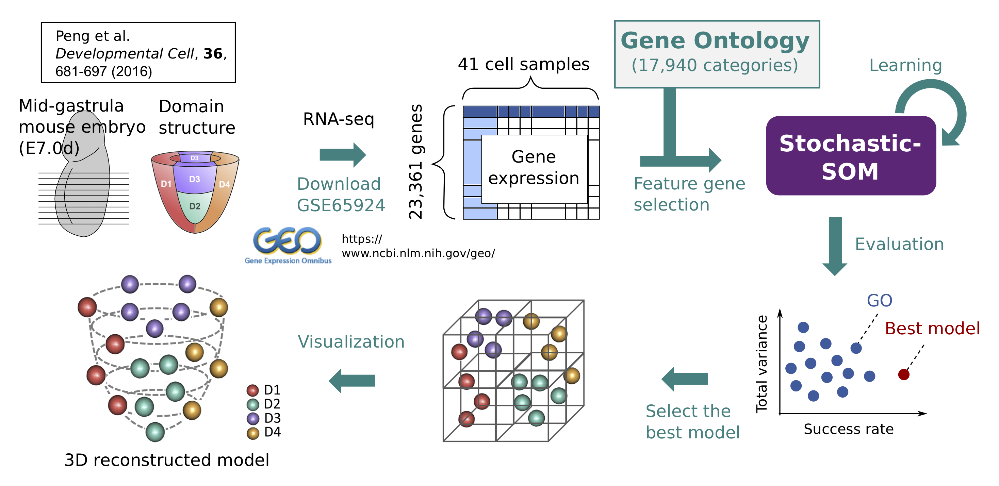
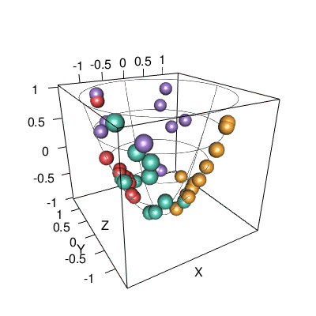
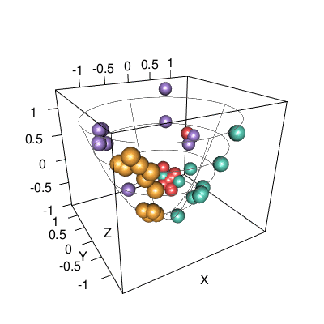
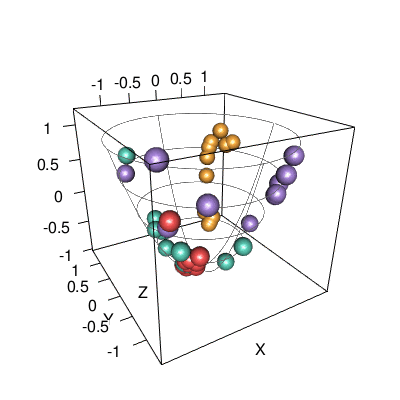

# gastrula-reconst
Novel computational modeling and analysis of mouse mid-gastrula morphogenesis by self-organizing-map (SOM) clustering.




## Requirement
* R		3.5.1
* BiocInstaller	1.30.0
* GO.db		3.6.0
* biomaRt 	2.36.1 (Ensembl Release 94)
* genefilter	1.62.0
* goProfiles	1.42.0
* topGO		2.32.0
* org.Mm.eg.db	3.6.0
* corrplot	0.84
* gplots	3.0.1
* RColorBrewer	1.1.2
* getopt	1.20.2
* rgl		0.99.16

## Gene expression profiles for cryo-sectioned mouse embryo
To reconstruct spatial structure of mid-gastrual mouse embryo (E7.0d), 
gene expression profiles for cryo-sectioned embryo laser microdissection study by [Peng et al.](https://www.ncbi.nlm.nih.gov/pubmed/27003939), ***GSE65924_E1.gene.expression.txt.gz*** downloaded from ([GSE65924](https://www.ncbi.nlm.nih.gov/geo/query/acc.cgi?acc=GSE65924)), is given as input.
The gene expression profiles for each of eleven frozen sections were separated into four regions (anterior, posterior, left, and right), where a total of 41 samples are available (the most distal section has no right and left samples, and there is one low expression sample). Each sample is composed of a small number of cells (about 20 cells per sample) and not single-cell data.
The read counts of 23,631 genes by RNA-seq for the 41 samples are normalized bt FPKM.
[Peng et al.](https://www.ncbi.nlm.nih.gov/pubmed/27003939) have already reported that the 41 samples can be grouped into four spatial domains  (D1: anterior, D2: lateral-distal, D3: lateral-proximal, and D4: posterior) by hierarchical clustering based on differentially expressed genes (DEGs) and PCA.

## Usage

### ■ STEP 1: Get Gene Ontology (GO) information
***get_GO.r*** creates ***output*** directory, 
and generates ***go2term.txt***, ***go2offsprings.txt***, 
and ***go2gene.txt*** in the directory using ***biomaRt*** package, 
which include terms, offsprings, and gene sets information for each GO, repectively.
```
$ Rscript get_GO.r
```
**[Output]**
- output/go2term.txt
- output/go2offsprings.txt
- output/go2gene.txt


### ■ STEP 2: Generate gene expression tables
***generate_exprs.r*** generates gene expression tables according to 158 PCA genes selected by Peng et al. and 
mouse-specific 6,778 GO gene sets (October 17, 1028) out of all 17,940 GOs with proper gene size
(1,000 genes or less, and at least three mouse genes after low-expression filtering) to exclude too large or too small GOs.
```
$ Rscript generate_exprs.r
```
**[Output]**
- exprs_peng/exprs.log10.E1.allgenes.txt
- exprs_peng/exprs.log10.E1.peng158.txt
- exprs_go/exprs.log10.E1.GOXXXXXX.txt


### ■ STEP 3: Count the number of genes
***count_genes.sh*** counts the number of genes for each expression table in 
***exprs_go*** and ***exprs_peng*** directories, 
and outputs gene count tables ***go2size.go.txt*** and ***go2size.peng.txt***.
```
$ ./count_genes.sh
``` 
**[Output]**
- output/go2size.go.txt
- output/go2size.peng.txt


### ■ STEP 4: Run stochastic self-organizing map (stochastic-SOM) clustering (*submit jobs via `qsub`*)
***run_som.sh*** executes stochastic-SOM clustering for all gene expression profiles in 
***exprs_go*** and ***exprs_peng***. 
It will take several hours to finish SOM clustering for all expression data.
Please modify ***run_som.sh*** according to the environment of user's cluster machine if necessary.
```
$ ./run_som.sh exprs_go tiny
$ ./run_som.sh exprs_peng tiny
```
If you want to execute stochastic-SOM clustering for each GO individually,
the followings are also available.
```
$ python som.py <PATH/TO/EXPRESSION_PROFILE> <PATH/TO/OUTPUT_DIRECTORY>
```

**[Output]**
- result_som.exprs_go
- result_som.exprs_peng


### ■ STEP 5: Evaluation (*submit jobs via `qsub`*)
***run_compScore.sh*** computes ***success rate*** and ***total variance*** for all SOM results in the input directories.
Please modify ***run_compScore.sh*** according to the environment of user's cluster machine if necessary.
```
$ mkdir result_score_tables
$ ./run_compScore.sh result_som.exprs_go result_score_tables/score_table_go.txt
$ ./run_compScore.sh result_som.exprs_peng result_score_tables/score_table_peng.txt
```

**[Output]**
- result_score_tables/score_table_go.txt
- result_score_tables/score_table_peng.txt


### ■ STEP 6: Generate gene expression tables consisting of two GOs and run stocahstic-SOM clustering
To increase success rate, this step enables us to test the reconstruction by combinations of all pairs of GOs.
In the following example,
***generate_comb_pair_exprs.r*** generates gene expression tables based on combinations of pairs of GO:0060412 and each of the other 6,777 GOs.
`-t` and `-i` specify the input score tables generated in **STEP 5** and input directory including all gene expression profiles, respectively. `-g` and `-k` specify a base GO for the combinations of all pairs and the number of GOs to be combined with the base GO, respectively. The GO combinations can be changed by specifying another GO as a base in `-g` option instead of GO0060412. The resulting expression profiles are generated in an output directory specified by `-o` option.
After running ***run_som.sh*** and ***run_compScore.sh***, the user will get ***score_table_go_comb2.txt***.
```
### 2 GOs combinations including GO:0060412 ###
$ Rscript generate_comb_pair_exprs.r --help
$ Rscript generate_comb_pair_exprs.r -t result_score_tables/score_table_go.txt -g GO0060412 -k 1 -i exprs_go -o exprs_go_comb2
$ ./run_som.sh exprs_go_comb2 tiny
$ ./run_compScore.sh result_som.exprs_go_comb2 result_score_tables/score_table_go_comb2.txt
```
**[Output]**
- exprs_go_comb2/exprs.log10.E1.GOXXXXXX-GOXXXXXX.txt
- result_som.exprs_go_comb2
- result_score_tables/score_table_go_comb2.txt


### ■ STEP 7: Generate gene expression tables consisting of more than two GOs and run SOM clustering
This step further tests all combinations of from three to six GOs including one base GO (e.g., GO:0060412). ***generate_comb_multi_exprs.r*** generates gene expression profiles based on combinations of three or more GOs with higher success rate, where the options `-t`, `-g`, `-k`, `-i`, and `-o` are the same as ***generate_comb_pair_exprs.r*** in **STEP 6**, and `-c` specifies the threshold of the success rate for candidates of GO combinations.
After running ***run_som.sh*** and ***run_compScore.sh***, the user will get ***score_table_go_comb3.txt***, ***score_table_go_comb4.txt***, ***score_table_go_comb5.txt***, and ***score_table_go_comb6.txt***.
```
### 3 GOs combinations including GO:0060412 ###
$ Rscript generate_comb_multi_exprs.r --help
$ Rscript generate_comb_multi_exprs.r -t result_score_tables/score_table_go_comb2.txt -g GO0060412 -k 2 -c 0.85 -i exprs_go -o exprs_go_comb3
$ ./run_som.sh exprs_go_comb3 tiny
$ ./run_compScore.sh result_som.exprs_go_comb3 result_score_tables/score_table_go_comb3.txt

### 4 GOs combinations including GO:0060412 ###
$ Rscript generate_comb_multi_exprs.r -t result_score_tables/score_table_go_comb3.txt -g GO0060412 -k 3 -c 0.85 -i exprs_go -o exprs_go_comb4
$ ./run_som.sh exprs_go_comb4 tiny 
$ ./run_compScore.sh result_som.exprs_go_comb4 result_score_tables/score_table_go_comb4.txt

### 5 GOs combinations including GO:0060412 ###
$ Rscript generate_comb_multi_exprs.r -t result_score_tables/score_table_go_comb4.txt -g GO0060412 -k 4 -c 0.85 -i exprs_go -o exprs_go_comb5
$ ./run_som.sh exprs_go_comb5 tiny
$ ./run_compScore.sh result_som.exprs_go_comb5 result_score_tables/score_table_go_comb5.txt

### 6 GOs combinations including GO:0060412 ###
$ Rscript generate_comb_multi_exprs.r -t result_score_tables/score_table_go_comb5.txt -g GO0060412 -k 5 -c 0.85 -i exprs_go -o exprs_go_comb6
$ ./run_som.sh exprs_go_comb6 tiny
$ ./run_compScore.sh result_som.exprs_go_comb6 result_score_tables/score_table_go_comb6.txt
```
**[Output]**
- exprs_go_comb3/exprs.log10.E1.GOXXXXXX-GOXXXXXX-GOXXXXXX.txt
- exprs_go_comb4/exprs.log10.E1.GOXXXXXX-GOXXXXXX-GOXXXXXX-GOXXXXXX.txt
- exprs_go_comb5/exprs.log10.E1.GOXXXXXX-GOXXXXXX-GOXXXXXX-GOXXXXXX-GOXXXXXX.txt
- exprs_go_comb6/exprs.log10.E1.GOXXXXXX-GOXXXXXX-GOXXXXXX-GOXXXXXX-GOXXXXXX-GOXXXXXX.txt
- result_som.exprs_go_comb3
- result_som.exprs_go_comb4
- result_som.exprs_go_comb5
- result_som.exprs_go_comb6
- result_score_tables/score_table_go_comb3.txt
- result_score_tables/score_table_go_comb4.txt
- result_score_tables/score_table_go_comb5.txt
- result_score_tables/score_table_go_comb6.txt


### ■ STEP 8: Generate gene expression tables with deletion of one or more genes
In this step, to test whether the success rate can be further increased,
genes are removed one by one combinations from input gene expression profile.
As an example, the combination of five GOs (GO:0060412, GO:0005021, GO:2000392, GO:0031994, and GO:0070986) is given as an input in the following executions.
***generate_comb_genes_exprs.r*** generates gene expression profiles in which single or combinatorial genes were deleted.
The number of genes to be deleted can be specified by `-k` option, where `-e` and `-o` options specify input gene expression profile and an output directory, respectively.
```
### Delete one gene ###
$ Rscript generate_comb_genes_exprs.r --help
$ Rscript generate_comb_genes_exprs.r -e exprs_go_comb5/exprs.log10.E1.GO0060412-GO0005021-GO2000392-GO0031994-GO0070986.txt -k 1 -o exprs_go_comb5_del1
$ ./run_som.sh exprs_go_comb5_del1 tiny
$ ./run_compScore.sh result_som.exprs_go_comb5_del1 result_score_tables/score_table_go_comb5_del1.txt

### Delete two genes ###
$ Rscript generate_comb_genes_exprs.r -e exprs_go_comb5/exprs.log10.E1.GO0060412-GO0005021-GO2000392-GO0031994-GO0070986.txt -k 2 -o exprs_go_comb5_del2
$ ./run_som.sh exprs_go_comb5_del2 tiny
$ ./run_compScore.sh result_som.exprs_go_comb5_del2 result_score_tables/score_table_go_comb5_del2.txt

### Delete three genes ###
$ Rscript generate_comb_genes_exprs.r -e exprs_go_comb5/exprs.log10.E1.GO0060412-GO0005021-GO2000392-GO0031994-GO0070986.txt -k 3 -o exprs_go_comb5_del3
$ ./run_som.sh exprs_go_comb5_del3 tiny
$ ./run_compScore.sh result_som.exprs_go_comb5_del3 result_score_tables/score_table_go_comb5_del3.txt
```
**[Output]**
- exprs_go_comb5_del1
- exprs_go_comb5_del2
- exprs_go_comb5_del3
- result_score_tables/score_table_go_comb5_del1.txt
- result_score_tables/score_table_go_comb5_del2.txt
- result_score_tables/score_table_go_comb5_del3.txt


### ■ STEP 9: Delete further genes 
To investigate which genes are the most influential spatical discriminators, 
***generate_comb_genes_exprs.r*** removes each of the genes in an input expression profile to see the reduction of the success rate.
In the following example, *Id2* is removed singularly or by pairs with the other genes in the above 5 GOs combination (GO:0060412, GO:0005021, GO:2000392, GO:0031994, and GO:0070986) with deletion of *Arl13b* and *Smad7*.
```
$ mkdir -p exprs_go_comb5_best22_del-Arl13b-Id2-Smad7
$ cp -p exprs_go_comb5_del3/exprs.log10.E1.comb_del-Arl13b-Id2-Smad7.txt exprs_go_comb5_best22_del-Arl13b-Id2-Smad7/
$ Rscript generate_comb_genes_exprs.r -e exprs_go_comb5_best22_del-Arl13b-Id2-Smad7/exprs.log10.E1.comb_del-Arl13b-Id2-Smad7.txt -k 1 -o exprs_go_comb5_best22_del-Arl13b-Id2-Smad7_del1
$ run_som.sh exprs_go_comb5_best22_del-Arl13b-Id2-Smad7_del1 tiny
$ run_compScore.sh result_som.exprs_go_comb5_best22_del-Arl13b-Id2-Smad7_del1 result_score_tables/exprs_go_comb5_best22_del-Arl13b-Id2-Smad7_del1.txt
```
**[Output]**
- exprs_go_comb5_best22_del-Arl13b-Id2-Smad7
- exprs_go_comb5_best22_del-Arl13b-Id2-Smad7_del1
- score_table_go_comb5_best22_del-Arl13b-Id2-Smad7_del1.txt


### ■ STEP 10: Count genes of the expression profiles of combinations of GOs
***count_genes_comb.sh*** counts the number of genes for each expression tables in 
***exprs_go_comb2***, ***exprs_go_comb3***, ***exprs_go_comb4***, ***exprs_go_comb5***, ***exprs_go_comb6***, 
***exprs_go_comb5_del1***, ***exprs_go_comb5_del2***, and ***exprs_go_comb5_del3*** by the same way as **STEP 3**.
```
$ ./count_genes_comb.sh
``` 
**[Output]**
- output/go2size.go_comb2.txt
- output/go2size.go_comb3.txt
- output/go2size.go_comb4.txt
- output/go2size.go_comb5.txt
- output/go2size.go_comb6.txt
- output/go2size.go_comb5_del1.txt
- output/go2size.go_comb5_del2.txt
- output/go2size.go_comb6_del3.txt


### ■ STEP 11: Plot SOM results
***plot_som_results.r*** plots figures of "success rate vs total variance". 
See Mori et al. (to be submitted) for the detals of calculations of success rate and total variance.
```
$ Rscript plot_som_results.r --help 
$ Rscript plot_som_results.r -t output/go2term.txt -s output/go2size.go.txt -q result_score_tables/score_table_go.txt -o output_go
$ Rscript plot_som_results.r -t output/go2term.txt -s output/go2size.go_comb2.txt -q result_score_tables/score_table_go_comb2.txt -o output_go_comb2
```
**[Output]**
- \<output directory\>/distributions.pdf
- \<output directory\>/tbl.all.txt


|||
|:------------------------------------------------:|:------------------------------------------------------:|
|6,778 GOs|Pairs of GO:0060412 and each of the other 6,777 GOs|

The horizontal and vertical axes show the success rate and the total variance, respectively. Each dot indicates a feature gene set selected by GOs. The left figure shows the results of mouse-specific 6,778 GOs out of all 17,940 GOs with proper gene size (1,000 genes or less, and at least three mouse genes after low-expression filtering). The right figure shows the result of all pairs of GO:0060412 and the other 6,777 GOs.


### ■ STEP 12: Plot 3D-models
This procedure visualizes mid-gastrula mouse embryo structure by projecting cell samples on a paraboloid based on position information estimated by stochastic-SOM clustering.
See Supplementary Information of Mori et al. (to be submitted) for more details of the visualization method.
***plot_3D-model.r*** generates png images and gif movies of reconstructed 3d-model from the stchastic-SOM clustering results with the higher success rate than a cutoff specified by option `-c` in 
***result_som.exprs_go***, ***result_som.exprs_go_comb5***, and ***result_som.exprs_go_comb5_del2***. 
If you want to generate movies, set `TRUE` to the `-m` option.
The options `-i`, `-e`, and `-o` specify directories storing stocahstic-SOM clustering results, gene expression profiles, and an output directory, respectively, and `-s` specifies a score table.
```
$ Rscript plot_3D-model.r --help
$ Rscript plot_3D-model.r -i result_som.exprs_go -e exprs_go -s result_score_tables/score_table_go.txt -c 0.6 -m False -o output_go/3d-model_exprs_go
$ Rscript plot_3D-model.r -i result_som.exprs_go_comb5 -e exprs_go_comb5 -s result_score_tables/score_table_go_comb5.txt -c 0.95 -m False -o output_go_comb5/3d-model_exprs_go_comb5
$ Rscript plot_3D-model.r -i result_som.exprs_go_comb5_del2 -e exprs_go_comb5_del2 -s result_score_tables/score_table_go_comb5_del2.txt -c 0.95 -m False -o output_go_comb5_del2/3d-model_exprs_go_comb5_del2
```
**[Output]**
- output_go/3d-model_exprs_go
- output_go/3d-model_exprs_go_comb5
- output_go/3d-model_exprs_go_comb5_del2

||||
|:--------:|:---------------:|:-----------------------------------------:|
|GO:0060412|5 GOs combination<sup>1</sup>|5 GOs combination<sup>1</sup> without *Arl13b* and *Smad7*|

In above 3D-models, red, green, purple, and yellow plots indicate cell samples from domains D1, D2, D3, and D4, respectively.


### ■ STEP 13: Plot correlation matrix of domains
***plot_corMatrix_domain.r*** computes domain correlations based on the mean values of gene expressions in for four domains and plots its correlation matrix as heat maps for all GOs listed in ***\<directory name\>/tbl.all.txt***.
The cutoff of the success rate can be change by the `-c` option.
The options `-e`, `-i`, and `-o` specify directories storing gene expression profiles, evaluation results, and an output directory, respectively, `-t` specifies an input file including sample and domain information.
```
$ Rscript plot_corMatrix_domain.r --help
$ Rscript plot_corMatrix_domain.r -e exprs_go -i output_go/tbl.all.txt -t data/sample2domain.txt -c 0.6 -o output_go/corr_domain.pdf
$ Rscript plot_corMatrix_domain.r -e exprs_go_comb5 -i output_go_comb5/tbl.all.txt -t data/sample2domain.txt -c 0.95 -o output_go_comb5/corr_domain.pdf
$ Rscript plot_corMatrix_domain.r -e exprs_go_comb5_del2 -i output_go_comb5_del2/tbl.all.txt -t data/sample2domain.txt -c 0.95 -o output_go_comb5_del2/corr_domain.pdf
```
**[Output]**
- \<output directory\>/corr_domain.pdf

||||
|:-----:|:-----:|:-----:|
|GO:0060412|5 GOs combination<sup>1</sup>|5 GOs combination<sup>1</sup> without *Arl13b* and *Smad7*|


<sup>1</sup> The 5 GOs combinaton consists of GO:0064120, GO:0005021, GO:2000392, GO:0031994, and GO:0070986.
