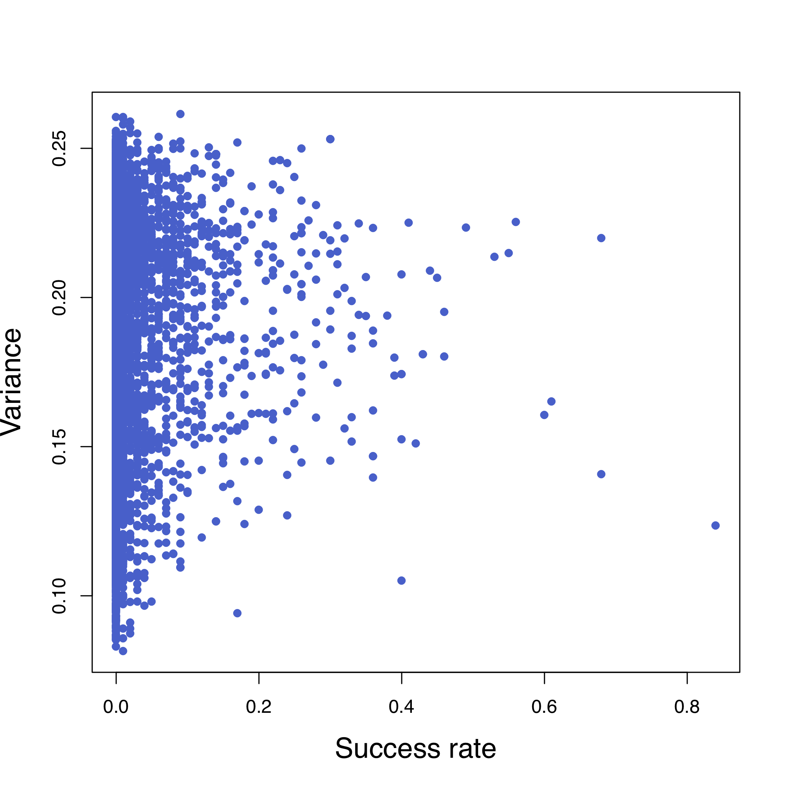
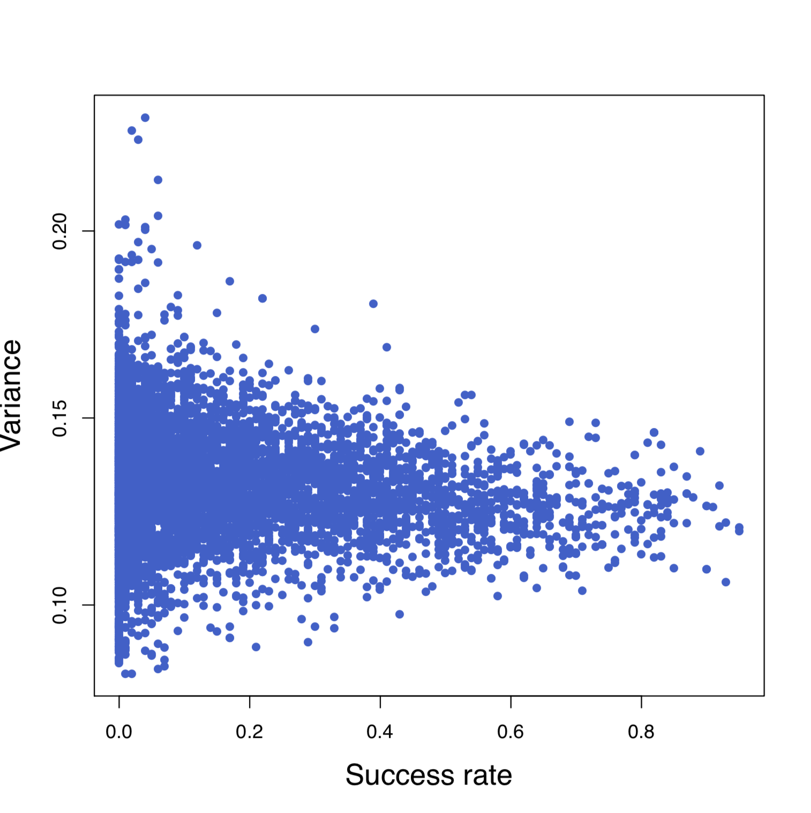
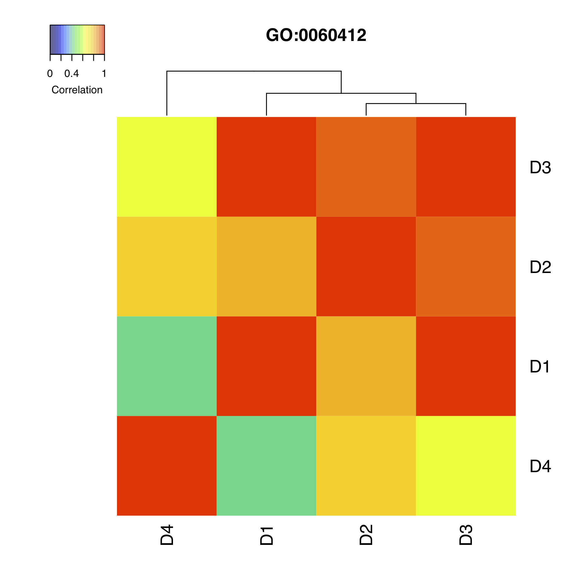
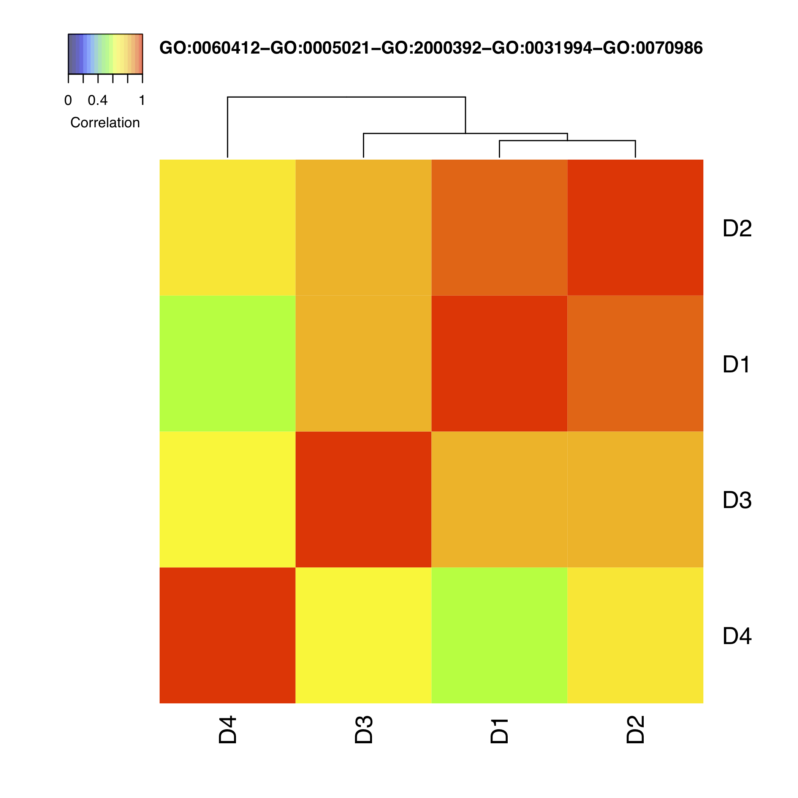
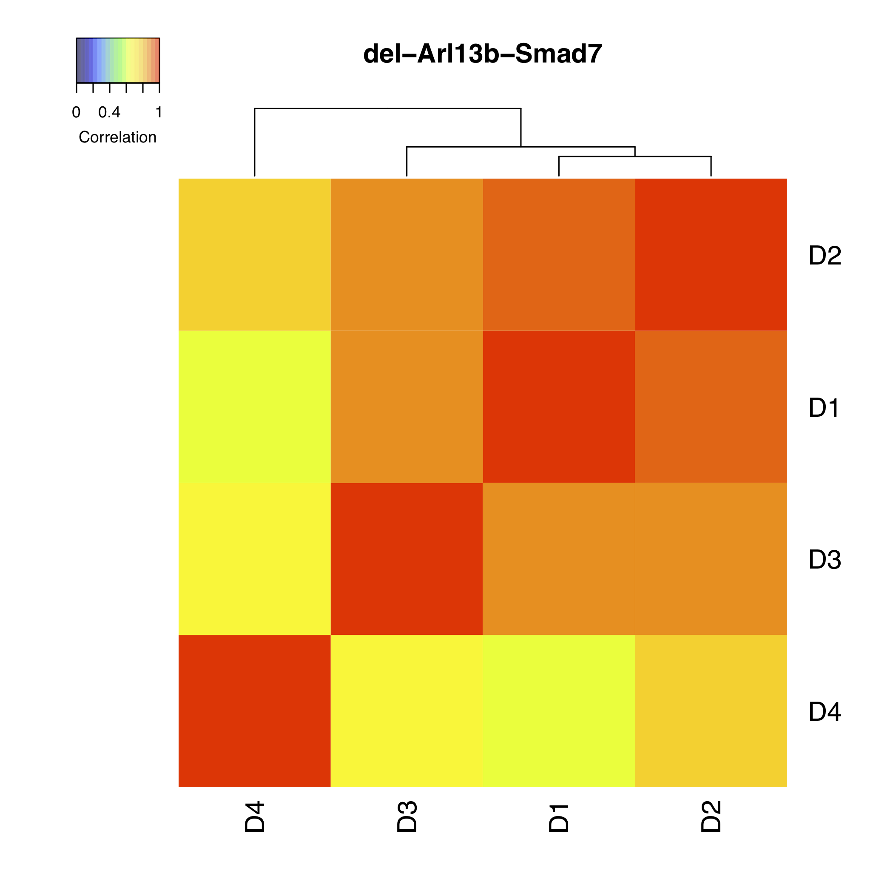

# gastrula-reconst
Novel computational modeling and analysis of mouse mid-gastrula morphogenesis by self-organizing-map (SOM) clustering.

## Requirement
* R		3.5.1
* BiocInstaller	1.30.0
* GO.db		3.6.0
* biomaRt 	2.36.1 (Ensembl Release 94)
* genefilter	1.62.0
* goProfiles	1.42.0
* topGO		2.32.0
* org.Mm.eg.db	3.6.0
* corrplot	0.84
* gplots	3.0.1
* RColorBrewer	1.1.2
* getopt	1.20.2
* rgl		0.99.16

## Expression data
The input expression data ***GSE65924_E1.gene.expression.txt.gz*** can be downloaded 
from NCBI Gene Expression Omnibus [GSE65924](https://www.ncbi.nlm.nih.gov/geo/query/acc.cgi?acc=GSE65924). 
The expression data was obtained from four sites (anterior, posterior, left, and right) of eleven frozen sections cut out 
from a mid-gastrula mouse embryo by [Peng et al.](https://www.ncbi.nlm.nih.gov/pubmed/27003939), 
where it is not single-cell data but it is composed of a small number of cells 
(about 20 cells per sample). The expression levels of 23,361 genes for 41 samples are stored as values normalized 
to FPKM (fragments per kilobase of exon per million reads mapped fragments).

## Usage

### STEP 1: Get Gene Ontology Information
***get_GO.r*** creates ***output*** directory, 
and generates ***go2term.txt***, ***go2offsprings.txt***, 
and ***go2gene.txt*** in the directory using ***biomaRt*** package.
```
$ Rscript get_GO.r
```
**[Output]**
- output/go2term.txt
- output/go2offsprings.txt
- output/go2gene.txt


### STEP 2: Generate gene expression tables
***generate_exprs.r*** generates gene expression tables according to PCA genes selected by Peng et al. and GOs.
```
$ Rscript generate_exprs.r
```
**[Output]**
- exprs_peng/exprs.log10.E1.allgenes.txt
- exprs_peng/exprs.log10.E1.peng158.txt
- exprs_go/exprs.log10.E1.GOXXXXXX.txt


### STEP 3: Count the number of genes
***count_genes.sh*** counts the number of genes for each expression table in 
***exprs_go*** and ***exprs_peng*** directories.
```
$ ./count_genes.sh
``` 
**[Output]**
- output/go2size.go.txt
- output/go2size.peng.txt


### STEP 4: Run self-organizing map (SOM) clustering (*submit jobs via `qsub`*)
***run_som.sh*** executes SOM clustering for all gene expression data in 
***exprs_go*** and ***exprs_peng***. 
It will take several hours to finish SOM clustering for all expression data.
Please modify ***run_som.sh*** according to the environment of user's cluster machine if necessary.
```
$ ./run_som.sh exprs_go tiny
$ ./run_som.sh exprs_peng tiny
```
**[Output]**
- result_som.exprs_go
- result_som.exprs_peng


### STEP 5: Evaluation (*submit jobs via `qsub`*)
***run_compScore.sh*** computes ***success rate*** and ***variance*** for all SOM results in the input directories.
Please modify ***run_compScore.sh*** according to the environment of user's cluster machine if necessary.
```
$ mkdir result_score_tables
$ ./run_compScore.sh result_som.exprs_go result_score_tables/score_table_go.txt
$ ./run_compScore.sh result_som.exprs_peng result_score_tables/score_table_peng.txt
```
**[Output]**
- result_score_tables/score_table_go.txt
- result_score_tables/score_table_peng.txt


### STEP 6: Generate gene expression tables consisting of two GOs and run SOM clustering
***generate_comb_pair_exprs.r*** generates gene expression tables based on combinations of two GOs including GO:0060412.
After running ***run_som.sh*** and ***run_compScore.sh***, the user will get ***score_table_go_comb2.txt***.
The GO combinations can be changed by specifying other GO as a base in `-g` option.
```
### 2 GOs combinations including GO:0060412 ###
$ Rscript generate_comb_pair_exprs.r --help
$ Rscript generate_comb_pair_exprs.r -t result_score_tables/score_table_go.txt -g GO0060412 -k 1 -i exprs_go -o exprs_go_comb2
$ ./run_som.sh exprs_go_comb2 tiny
$ ./run_compScore.sh result_som.exprs_go_comb2 result_score_tables/score_table_go_comb2.txt
```
**[Output]**
- exprs_go_comb2/exprs.log10.E1.GOXXXXXX-GOXXXXXX.txt
- result_som.exprs_go_comb2
- result_score_tables/score_table_go_comb2.txt


### STEP 7: Generate gene expression tables consisting of more than two GOs and run SOM clustering
***generate_comb_multi_exprs.r*** generates gene expression tables based on combinations of three or more GOs including GO:0060412 with high success_rate.
After running ***run_som.sh*** and ***run_compScore.sh***, the user will get ***score_table_go_comb3.txt***, ***score_table_go_comb4.txt***, ***score_table_go_comb5.txt***, and ***score_table_go_comb6.txt***.
In the same way as STEP 6, a base GO can be changed in `-g` option.
```
### 3 GOs combinations including GO:0060412 ###
$ Rscript generate_comb_multi_exprs.r --help
$ Rscript generate_comb_multi_exprs.r -t result_score_tables/score_table_go_comb2.txt -g GO0060412 -k 2 -c 0.85 -i exprs_go -o exprs_go_comb3
$ ./run_som.sh exprs_go_comb3 tiny
$ ./run_compScore.sh result_som.exprs_go_comb3 result_score_tables/score_table_go_comb3.txt

### 4 GOs combinations including GO:0060412 ###
$ Rscript generate_comb_multi_exprs.r -t result_score_tables/score_table_go_comb3.txt -g GO0060412 -k 3 -c 0.85 -i exprs_go -o exprs_go_comb4
$ ./run_som.sh exprs_go_comb4 tiny 
$ ./run_compScore.sh result_som.exprs_go_comb4 result_score_tables/score_table_go_comb4.txt

### 5 GOs combinations including GO:0060412 ###
$ Rscript generate_comb_multi_exprs.r -t result_score_tables/score_table_go_comb4.txt -g GO0060412 -k 4 -c 0.85 -i exprs_go -o exprs_go_comb5
$ ./run_som.sh exprs_go_comb5 tiny
$ ./run_compScore.sh result_som.exprs_go_comb5 result_score_tables/score_table_go_comb5.txt

### 6 GOs combinations including GO:0060412 ###
$ Rscript generate_comb_multi_exprs.r -t result_score_tables/score_table_go_comb5.txt -g GO0060412 -k 5 -c 0.85 -i exprs_go -o exprs_go_comb6
$ ./run_som.sh exprs_go_comb6 tiny
$ ./run_compScore.sh result_som.exprs_go_comb6 result_score_tables/score_table_go_comb6.txt
```
**[Output]**
- exprs_go_comb3/exprs.log10.E1.GOXXXXXX-GOXXXXXX-GOXXXXXX.txt
- exprs_go_comb4/exprs.log10.E1.GOXXXXXX-GOXXXXXX-GOXXXXXX-GOXXXXXX.txt
- exprs_go_comb5/exprs.log10.E1.GOXXXXXX-GOXXXXXX-GOXXXXXX-GOXXXXXX-GOXXXXXX.txt
- exprs_go_comb6/exprs.log10.E1.GOXXXXXX-GOXXXXXX-GOXXXXXX-GOXXXXXX-GOXXXXXX-GOXXXXXX.txt
- result_som.exprs_go_comb3
- result_som.exprs_go_comb4
- result_som.exprs_go_comb5
- result_som.exprs_go_comb6
- result_score_tables/score_table_go_comb3.txt
- result_score_tables/score_table_go_comb4.txt
- result_score_tables/score_table_go_comb5.txt
- result_score_tables/score_table_go_comb6.txt


### STEP 8: Generate gene expression tables with deletion of one or more genes
***generate_comb_genes_exprs.r*** generates gene expression tables in which combinatorial genes were deleted. The number of genes to be deleted can be specified by `-k` option.
```
### Delete a gene ###
$ Rscript generate_comb_genes_exprs.r --help
$ Rscript generate_comb_genes_exprs.r -e exprs_go_comb5/exprs.log10.E1.GO0060412-GO0005021-GO2000392-GO0031994-GO0070986.txt -k 1 -o exprs_go_comb5_del1
$ ./run_som.sh exprs_go_comb5_del1 tiny
$ ./run_compScore.sh result_som.exprs_go_comb5_del1 result_score_tables/score_table_go_comb5_del1.txt

### Delete two genes ###
$ Rscript generate_comb_genes_exprs.r -e exprs_go_comb5/exprs.log10.E1.GO0060412-GO0005021-GO2000392-GO0031994-GO0070986.txt -k 2 -o exprs_go_comb5_del2
$ ./run_som.sh exprs_go_comb5_del2 tiny
$ ./run_compScore.sh result_som.exprs_go_comb5_del2 result_score_tables/score_table_go_comb5_del2.txt

### Delete three genes ###
$ Rscript generate_comb_genes_exprs.r -e exprs_go_comb5/exprs.log10.E1.GO0060412-GO0005021-GO2000392-GO0031994-GO0070986.txt -k 3 -o exprs_go_comb5_del3
$ ./run_som.sh exprs_go_comb5_del3 tiny
$ ./run_compScore.sh result_som.exprs_go_comb5_del3 result_score_tables/score_table_go_comb5_del3.txt
```
**[Output]**
- exprs_go_comb5_del1
- exprs_go_comb5_del2
- exprs_go_comb5_del3
- result_score_tables/score_table_go_comb5_del1.txt
- result_score_tables/score_table_go_comb5_del2.txt
- result_score_tables/score_table_go_comb5_del3.txt


### STEP 9: Delete further genes 
In above experiments, the combination of 5 GOs with deletion of genes Arl13b and Smad7 achieved 100% success rate.
Here, in order to investigate which genes are the most influential spatial discriminators, 
***generate_comb_genes_exprs.r*** removed each of the 18 genes for 100% success rate to see the reductions of the success rate.
When Id2 (inhibitor of DNA binding 2) was remove, the success rate was dramatically reduced to 37%,
and if Id2 was removed with the other 17 genes as pairs, the success rate was further decreased in 12 out of 17 genes.
```
$ mkdir -p exprs_go_comb5_best22_del-Arl13b-Id2-Smad7
$ cp -p exprs_go_comb5_del3/exprs.log10.E1.comb_del-Arl13b-Id2-Smad7.txt exprs_go_comb5_best22_del-Arl13b-Id2-Smad7/
$ Rscript 08_generate_comb_genes_exprs.r -e exprs_go_comb5_best22_del-Arl13b-Id2-Smad7/exprs.log10.E1.comb_del-Arl13b-Id2-Smad7.txt -k 1 -o exprs_go_comb5_best22_del-Arl13b-Id2-Smad7_del1
$ ./04_run_som.sh exprs_go_comb5_best22_del-Arl13b-Id2-Smad7_del1 tiny
$ ./05_run_compScore.sh result_som.exprs_go_comb5_best22_del-Arl13b-Id2-Smad7_del1 result_score_tables/exprs_go_comb5_best22_del-Arl13b-Id2-Smad7_del1.txt
```


### STEP 10: Count genes of the expression tables consisting of multiple GOs
***count_genes_comb.sh*** counts the number of genes for each expression tables in 
***exprs_go_comb2***, ***exprs_go_comb3***, ***exprs_go_comb4***, ***exprs_go_comb5***, ***exprs_go_comb6***, 
***exprs_go_comb5_del1***, ***exprs_go_comb5_del2***, and ***exprs_go_comb5_del3***.
```
$ ./count_genes_comb.sh
``` 
**[Output]**
- output/go2size.go_comb2.txt
- output/go2size.go_comb3.txt
- output/go2size.go_comb4.txt
- output/go2size.go_comb5.txt
- output/go2size.go_comb6.txt
- output/go2size.go_comb5_del1.txt
- output/go2size.go_comb5_del2.txt
- output/go2size.go_comb6_del3.txt


### STEP 11: Plot SOM results
***plot_som_results.r*** plots figures of "success rate vs variance", "the number of features vs success rate". 
```
$ Rscript plot_som_results.r --help 
$ Rscript plot_som_results.r -t output/go2term.txt -s output/go2size.go.txt -q result_score_tables/score_table_go.txt -o output_go
$ Rscript plot_som_results.r -t output/go2term.txt -s output/go2size.go_comb2.txt -q result_score_tables/score_table_go_comb2.txt -o output_go_comb2
$ Rscript plot_som_results.r -t output/go2term.txt -s output/go2size.go_comb3.txt -q result_score_tables/score_table_go_comb3.txt -o output_go_comb3
$ Rscript plot_som_results.r -t output/go2term.txt -s output/go2size.go_comb4.txt -q result_score_tables/score_table_go_comb4.txt -o output_go_comb4
$ Rscript plot_som_results.r -t output/go2term.txt -s output/go2size.go_comb5.txt -q result_score_tables/score_table_go_comb5.txt -o output_go_comb5
$ Rscript plot_som_results.r -t output/go2term.txt -s output/go2size.go_comb6.txt -q result_score_tables/score_table_go_comb6.txt -o output_go_comb6
$ Rscript plot_som_results.r -t output/go2term.txt -s output/go2size.go_comb5_del1.txt -q result_score_tables/score_table_go_comb5_del1.txt -o output_go_comb5_del1
$ Rscript plot_som_results.r -t output/go2term.txt -s output/go2size.go_comb5_del2.txt -q result_score_tables/score_table_go_comb5_del2.txt -o output_go_comb5_del2
$ Rscript plot_som_results.r -t output/go2term.txt -s output/go2size.go_comb5_del3.txt -q result_score_tables/score_table_go_comb5_del3.txt -o output_go_comb5_del3
```
**[Output]**
- \<output directory\>/distributions.pdf
- \<output directory\>/tbl.all.txt


  

### STEP 12: Plot 3D-models
***plot_3D-model.r*** generates png images of reconstructed 3d-model from the SOM results with the specified success rate by option `-c` in 
***result_som.exprs_go***, ***result_som.exprs_go_comb5***, and ***result_som.exprs_go_comb5_del2***. 
The cutoff of the success rate can be change by the `-c` option. If you want to generate movies, set `True` to the `-m` option. 
The type of 3D-model can be specified by `-t` option (`-t 1`: random model, `-t 2`: similarity-based model). 
```
$ Rscript plot_3D-model.r --help
$ Rscript plot_3D-model.r -i result_som.exprs_go -e exprs_go -s result_score_tables/score_table_go.txt -c 0.6 -m False -t 2 -o output_go/3d-model_exprs_go
$ Rscript plot_3D-model.r -i result_som.exprs_go_comb5 -e exprs_go_comb5 -s result_score_tables/score_table_go_comb5.txt -c 0.95 -m False -t 2 -o output_go_comb5/3d-model_exprs_go_comb5
$ Rscript plot_3D-model.r -i result_som.exprs_go_comb5_del2 -e exprs_go_comb5_del2 -s result_score_tables/score_table_go_comb5_del2.txt -c 0.95 -m False -t 2 -o output_go_comb5_del2/3d-model_exprs_go_comb5_del2
```
**[Output]**
- output_go/3d-model_exprs_go
- output_go/3d-model_exprs_go_comb5
- output_go/3d-model_exprs_go_comb5_del2


### STEP 13: Plot correlation matrix of domains
***plot_corMatrix_domain.r*** plots correlation matrix of domains as heat maps 
for all GOs listed in ***\<directory name\>/tbl.all.txt***.
The cutoff of the success rate can be change by the `-c` option.
```
$ Rscript plot_corMatrix_domain.r --help
$ Rscript plot_corMatrix_domain.r -e exprs_go -i output_go/tbl.all.txt -t data/sample2domain.txt -c 0.6 -o output_go/corr_domain.pdf
$ Rscript plot_corMatrix_domain.r -e exprs_go_comb5 -i output_go_comb5/tbl.all.txt -t data/sample2domain.txt -c 0.95 -o output_go_comb5/corr_domain.pdf
$ Rscript plot_corMatrix_domain.r -e exprs_go_comb5_del2 -i output_go_comb5_del2/tbl.all.txt -t data/sample2domain.txt -c 0.95 -o output_go_comb5_del2/corr_domain.pdf
```
**[Output]**
- \<output directory\>/corr_domain.pdf


  
